# Weekly progress journal

## Instructions

In this journal you will document your progress of the project, making use of the weekly milestones.

Every week you should 

1. write down **on the day of the lecture** a short plan (bullet list is sufficient) of how you want to 
   reach the weekly milestones. Think about how to distribute work in the group, 
   what pieces of code functionality need to be implemented.
2. write about your progress **until Tuesday, 11:00** before the next lecture with respect to the milestones.
   Substantiate your progress with links to code, pictures or test results. Reflect on the
   relation to your original plan.

We will give feedback on your progress on Tuesday before the following lecture. Consult the 
[grading scheme](https://computationalphysics.quantumtinkerer.tudelft.nl/proj3-grading/) 
for details how the journal enters your grade.

Note that the file format of the journal is *markdown*. This is a flexible and easy method of 
converting text to HTML. 
Documentation of the syntax of markdown can be found 
[here](https://docs.gitlab.com/ee/user/markdown.html#gfm-extends-standard-markdown). 
You will find how to include [links](https://docs.gitlab.com/ee/user/markdown.html#links) and 
[images](https://docs.gitlab.com/ee/user/markdown.html#images) particularly.

## Week 1 - planning the project
(due 21 May 2025, 23:59)

Discussions about the project design are best done in person with the course team or via the planning issue #1. Once your project is approved, copy the project plan here.

**WEEK 1 MILESTONES**
- Research potential projects and quantitative analysis methods
- Submit planning issue
- Write project plan in journal with literature 
- Create skeleton for project
- Begin planning (and if idea approved, coding) simulation and analysis functions

**Project 3: Turing Patterns (Reaction-Diffusion Systems)**
Reaction–diffusion models explain how complex spatial patterns can emerge from simple chemical interactions. These mechanisms are believed to underlie
the phenomena such as animal skin patterns to ecological structures and were first described by Alan Turing in 1952 [1]. We can use the Gray–Scott model 
which is a well-studied system that captures behavior using only two reacting and diffusing species. It is a well-known example for studying how patterns form 
and should therefore be a good choice for a short simulation project. An exploration of this model was published by Pearson (1993) [2], providing a reference 
for validation.

_Goal:_ Simulate the Gray–Scott model in 2D and reproduce characteristic Turing patterns (e.g., spots, stripes, and labyrinths) for selected parameters.

Gray–Scott Model: The reaction-diffusion equations
$$ \frac{\partial u}{\partial t} = D_u \nabla^2 u -uv^2 + F(1-u) $$
$$ \frac{\partial v}{\partial t} = D_v \nabla^2 v +uv^2 - (F+k)v $$

where $k$ is the kill rate, $F$ the feed rate, $D_u$ and $D_v$ the diffusion coefficients, and $u,v$ the concentration of two different chemicals.

_Outline:_
- Solve the Gray Scott model by using the 5-point stencil method to discretize the equations in space, and the 4th order Runge-Kutta method to
discretize in time (or Euler if we want a simpler and possibly faster method but this could be less accurate /more instable).
   - Apply periodic boundary conditions,
   - Add small pertubations around steady state (u=1, v=0) such as random noise to the entire grid, or place a square somewhere.

_Simulation break down:_

- Initialize the grid: Set up u=1, v=0 then add a perturbation.
- Set parameters: diffusion coefficients, feed rate, kill rate, grid size, time step/number of steps for one simulation
- Main simulation loop: at each time step compute the laplacions of u and v with 5-point stencil, then update u and v with euler or RK4
- After: save data and visualise with plots (or animations?)
- Analyze: Minkowski metrics

We are going to compare our qualitative results to Pearson's from 1993 [2] and (if time allows) generate a similar phase diagram. 

_Quantitative analysis:_
- Minkowski metrics have been used for quantitative categorization of hexagonal and striped Turing patterns in Mecke 1996 [3]
- By calculating these measures and fitting polynomials to the results, we can directly compare with the reported values
- If time allows, it could be interesting to explore how the metrics differ for other generated patterns

[1] Turing, A. M. (1952). The Chemical Basis of Morphogenesis. Phil. Trans. R. Soc. Lond. B 237, 37–72.

[2] Pearson, J. E. (1993). Complex Patterns in a Simple System. Science, 261(5118), 189–192.

[3] Mecke, K. R. (1996). Morphological characterization of patterns in reaction-diffusion systems. Phys. Rev. E.

**20 MAY 10:30**

Basic project skeleton made. A placeholder sim (where nothing happens) created to test [save_data function](https://gitlab.kwant-project.org/computational_physics/projects/Project3_cnygren_sawellman/-/blob/master/analysis_utils.py?ref_type=heads#L34). 
Currently saves data in data/simulations/runs and writes a global masterlog, summarizing sim runs and chosen parameters.
Can be useful for filtering by specific paremeters (e.g. F) for data processing/visualization later. 

## Week 2
(due 27 May 2025, 11:00)

**WEEK 2 MILESTONES**
- Write grid, laplacian and step functions
- Get basic version of sim running
- Write minkowski metric and analysis functions and verify (using test arrays/pictures)
- Start planning how to visualize simulation results

**21 MAY 11:54**

Progress making [minkowski_analysis](https://gitlab.kwant-project.org/computational_physics/projects/Project3_cnygren_sawellman/-/blob/master/analysis_utils.py?ref_type=heads#L140)
function. Verified some of the subfunctions, for example testing [minkowski_metric](https://gitlab.kwant-project.org/computational_physics/projects/Project3_cnygren_sawellman/-/blob/master/analysis_utils.py?ref_type=heads#L22)
on a known binary array. The output values agree with expectations.

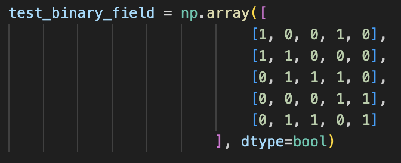
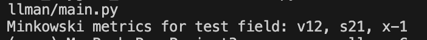

As well as testing that [threshold_curves](https://gitlab.kwant-project.org/computational_physics/projects/Project3_cnygren_sawellman/-/blob/master/analysis_utils.py?ref_type=heads#L70)
masks correctly as it iterates through threshold values. 

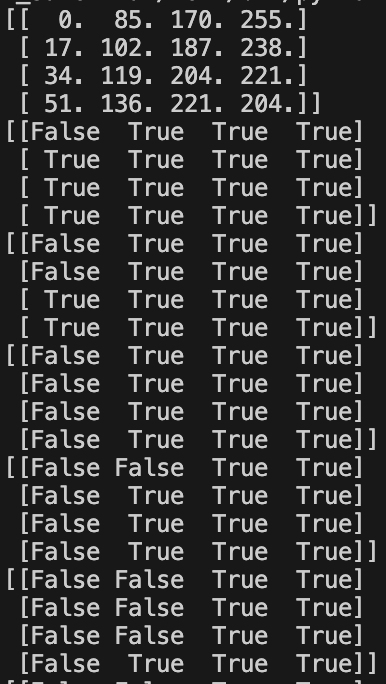

Attempted to [test](https://gitlab.kwant-project.org/computational_physics/projects/Project3_cnygren_sawellman/-/blob/master/main.py?ref_type=heads#L27) the minkowski_analysis function on the hexagonal pattern from Mecke 1996, to compare polynomial coefficient
values - these are of roughly the same order, but values deviate significantly. Will have to continue testing/bugfixing to find the issue.

**22 May 09:30**

Wrote basic simulation code. Consists of a [function](https://gitlab.kwant-project.org/computational_physics/projects/Project3_cnygren_sawellman/-/blob/bbb36655de5069b3f2a6eb73fc89dd460aa39c1f/projectcode.py#L24) that initializes the grid and a [simulation function](https://gitlab.kwant-project.org/computational_physics/projects/Project3_cnygren_sawellman/-/blob/bbb36655de5069b3f2a6eb73fc89dd460aa39c1f/projectcode.py#L46) which performs the actual sim. The code runs as expected. To recreate Pearson's patterns, multiplicative random noise is added and each step to solve the Laplacian equation in the spatial dimension is scaled with $2.5/N$ where N is the sidelength of the grid.
An example of spot formation for parameters F=0.037 and k=0.065:

Radially formed stripes:

**27 MAY 10:19**

Using the Minkowski functions on the raw signal arrays leads to curves with very sharp peaks. In order to get 
comparisons with Mecke, which are based on images of experimental diffusion patterns, a gaussian blur was applied - 
this maintained the morphological integrity, but reduced the sharp pixel staircases. Results yield curves that match
nicely Mecke, although there is a degree of jaggedness. Bootstrap errors still need to be calculated for v, s and chi 
values, which may account for some of the jagged lines. 

Mecke curves - full lines correspond to the dotted pattern and dashed to the striped pattern.

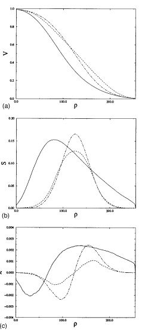

_Example_: sim curves for striped pattern:

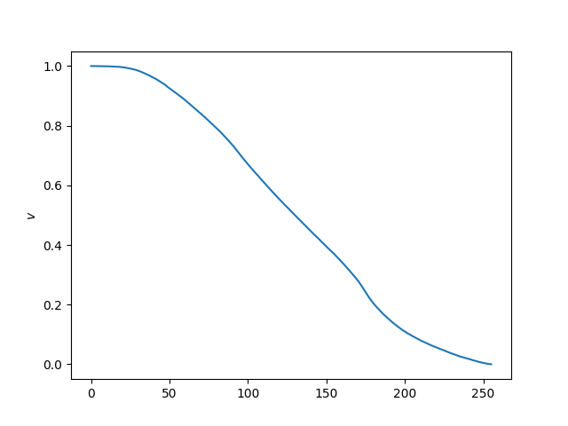
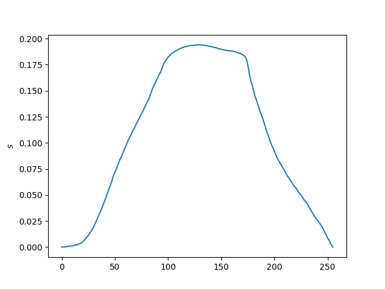
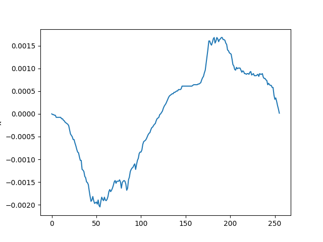

See also a visualisation of the binary field at different thresholds:

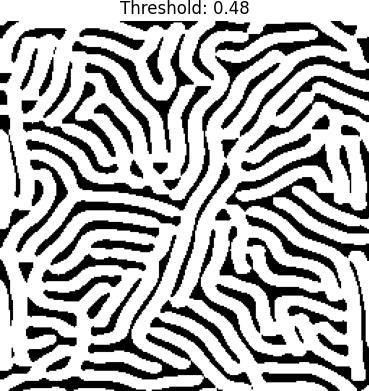
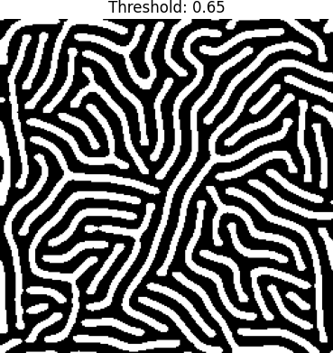
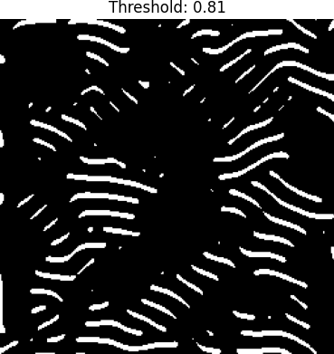

## Week 3
(due 3 June 2025, 11:00)

**Milestones**
- Retry poly fitting - both (maybe before, but def after errors)
- Implement errors: First pri - C
- Make nice plots of "observables" - both
- Make time animations: dots, stripes, turbulence - S
- Make phase diagram animations - S
- Start on presentation - S

**2 JUNE 9:27**

[Statistical errors calculated](https://gitlab.kwant-project.org/computational_physics/projects/Project3_cnygren_sawellman/-/blob/master/analysis_utils.py?ref_type=heads#L198) 
based on [(20) repetitions](https://gitlab.kwant-project.org/computational_physics/projects/Project3_cnygren_sawellman/-/blob/master/projectcode.py?ref_type=heads#L51) 
of the same experiment with identical parameters, but different random noise seeds.

[Polynomial fitting function](https://gitlab.kwant-project.org/computational_physics/projects/Project3_cnygren_sawellman/-/blob/master/analysis_utils.py?ref_type=heads#L301)
implemented - fits polynomials to transformed Minkowski metric data. Additionally, [plotting functions](https://gitlab.kwant-project.org/computational_physics/projects/Project3_cnygren_sawellman/-/blob/master/plotcode.py?ref_type=heads#L99)
to plot the raw data points, the line of best fit and Mecke's line of best fit for comparison.

Below you can see two examples - for functionals p_v and p_chi. The black points are the raw data points (with error bars), 
the orange lines our line of best fit, and the green line the comparison with literature (Mecke).

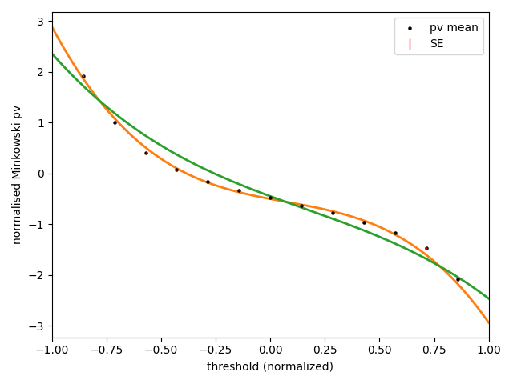
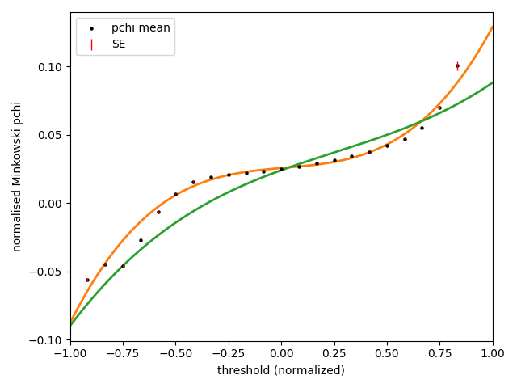

There is understandably some deviation, considering we are trying to adapt a method used on 
photos from experiment to simulation data. To mitigate the unrealistic sharp boundaries of simulated lattices, 
a [gaussian blur](https://gitlab.kwant-project.org/computational_physics/projects/Project3_cnygren_sawellman/-/blob/master/projectcode.py?ref_type=heads#L94) 
was applied to the final arrays. This makes for a more realistic comparison. I plan to show some example
images from the different rng runs in the presentation. 

Despite deviations in the curve shape, the overall trends match well, and most importantly will be the comparison
between two different patterns. There will be further discussion in the presentation.

The next step is to implement the above analysis to the striped pattern, as 
well as modify code for functional p_s analysis. 

**2 June 22:43**

Time-evolution plots are made with [animate_snapshots](https://gitlab.kwant-project.org/computational_physics/projects/Project3_cnygren_sawellman/-/blob/master/plotcode.py?ref_type=heads#L219). It reads saved .npz files to make the animation. Here is an example of the dots evolving as the simulation solves over time:

In the presentation we will additionally show gifs of the evolution of stripes and perhaps turbulence. If we see the relevance, other k,F - parameter combinatinos will also be shown.

To get an idea of the pattern variation along a line in the parameter space, we made [pattern sweep functions](https://gitlab.kwant-project.org/computational_physics/projects/Project3_cnygren_sawellman/-/blob/3108495262f0982dd7921c415eceb7d995b3ac6b/projectcode.py). Here, arrays of k- and F-values are passed to the function which computes a simulation for each set. Data will not be saved, but final snapshots are. These will be combined into an animation with [make_gif_from_folder](https://gitlab.kwant-project.org/computational_physics/projects/Project3_cnygren_sawellman/-/blob/master/plotcode.py?ref_type=heads#L269). The pattern sweep functions consist of three functions: [one_pattern_sim](https://gitlab.kwant-project.org/computational_physics/projects/Project3_cnygren_sawellman/-/blob/master/projectcode.py?ref_type=heads#L222), [one_pattern_sim_wrapper](https://gitlab.kwant-project.org/computational_physics/projects/Project3_cnygren_sawellman/-/blob/master/projectcode.py?ref_type=heads#L247), and [pattern_sweep_simulation](https://gitlab.kwant-project.org/computational_physics/projects/Project3_cnygren_sawellman/-/blob/master/projectcode.py?ref_type=heads#L251). This is the setup of the pattern sweep because it is multiprocessing to speed things up. The function one_pattern_sim holds all the actual code for the simulation run, the array clipping and the image plotting. One_pattern_sim_wrapper is a wrapper function because the multiprocess function cannot handle a function that takes several arguments. The pattern_sweep_simulation function does the actual multiprocessing and feeding of the right set of k,F-values to the one_pattern_sim_wrapper (and therefore the one_pattern_sim). To create a 100 frames for a pattern sweep, it took 9 minutes 38 seconds (=578 seconds). Normally creating one such image is around 45 secoconds which would equal 4500 seconds. A lot of time was saved. Below is an example of a pattern sweep at k=0.061, and F varying between 0.02 and 0.06 (100 points eqaully spaced):

It is not super beautiful and smooth. It is clear that the resulting pattern is extremely sensitive for even small changes in F. Making the transitions smooth does not seem feasible for the scope of our project. However, we still get an image of the pattern evolvement across a section of the phase space. 

Also started on presentation template. 

## Reminder final deadline

The deadline for project 3 is **9 June 23:59**. By then, you must have uploaded the presentation slides to the repository, and the repository must contain the latest version of the code.
